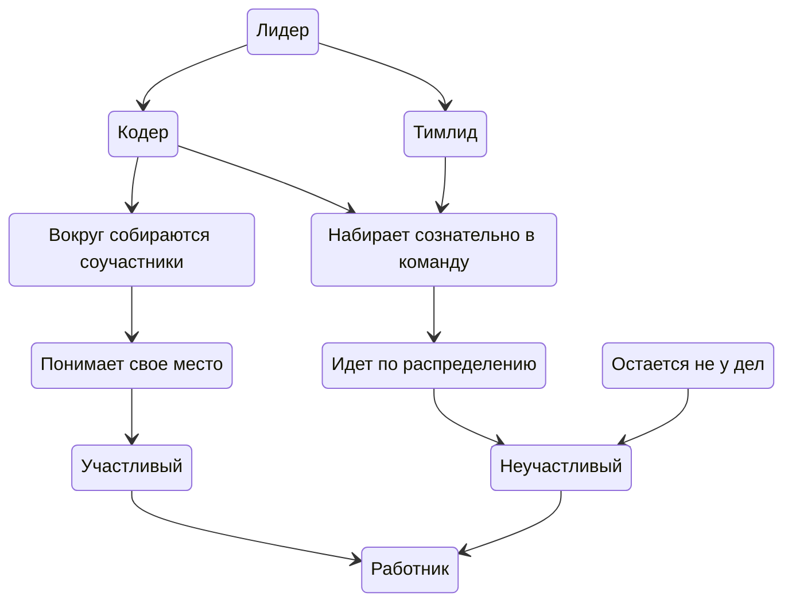

```mermaid
stateDiagram-v2
    AC : Лидер
    A : Кодер
    C : Тимлид
    BB : Вокруг собираются соучастники
    B : Набирает сознательно в команду
    AC-->A
    AC-->C
    A--> BB
    A-->B
    C-->B
    DD : Понимает свое место
    DDD : Идет по распределению
    D : Работник
    CD: Участливый
    CC: Неучастливый
    CD-->D
    CC-->D
    DD-->CD
    DDD-->CC
    DDDD : Остается не у дел
    DDDD-->CC
    BB-->DD
    B-->DDD  
    
```
